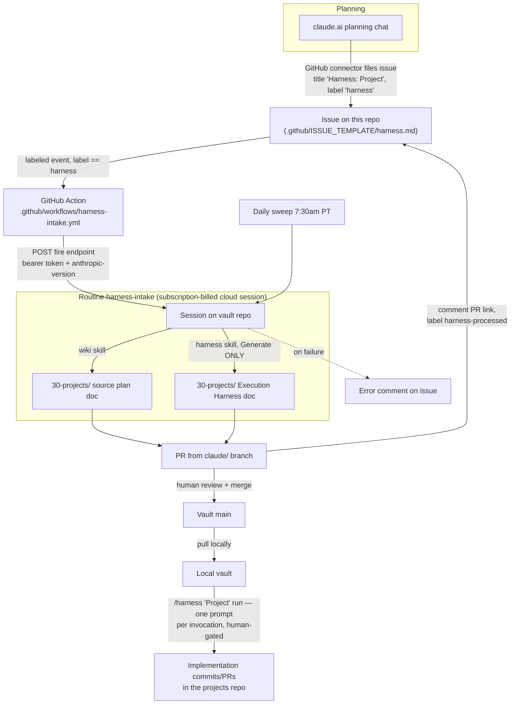

# ObsidianVault

Personal Obsidian knowledge vault — MOC-indexed atomic notes, project plans, and the automation that keeps them flowing. Conventions live in [.claude/CLAUDE.md](.claude/CLAUDE.md); retrieval/write protocol in the [wiki skill](.claude/skills/wiki/SKILL.md).

## Harness pipeline — data flow

A claude.ai planning chat turns into vault docs, an Execution Harness, and gated implementation work with no local steps. Details: `20-notes/Harness Automation Pipeline.md`.

<!-- KEEP IN SYNC: update this diagram whenever a pipeline component changes
     (workflow, issue template, harness skill, routine prompt/schedule, or the
     pipeline note). Rule lives in .claude/CLAUDE.md. -->

Execution stays human-gated (generation only in the cloud) until harnesses consistently pass review — graduation path in `20-notes/Harness Automation Pipeline.md`.
